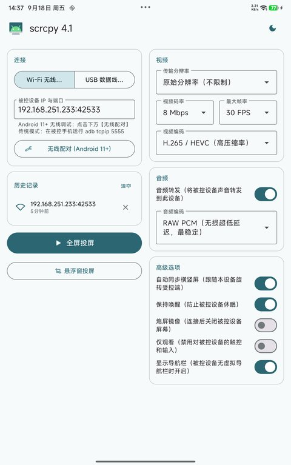
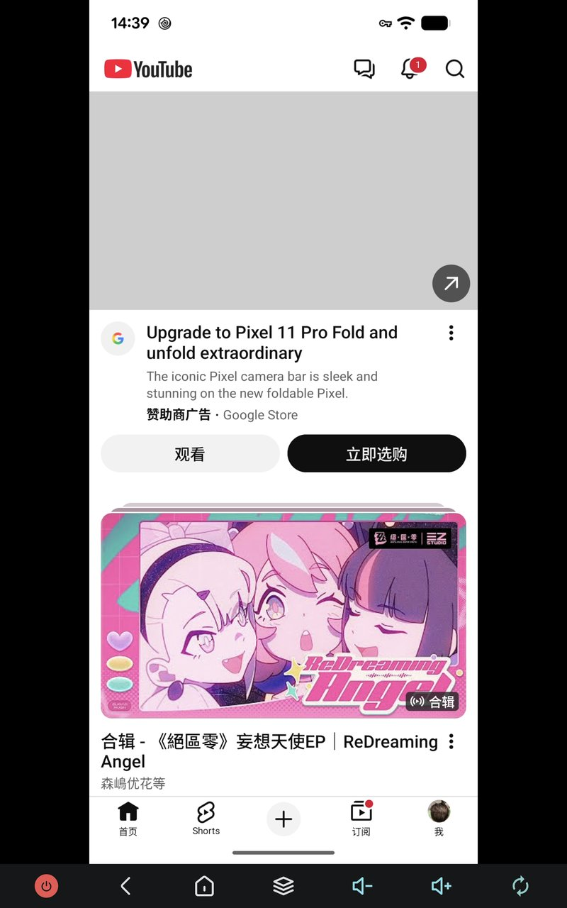
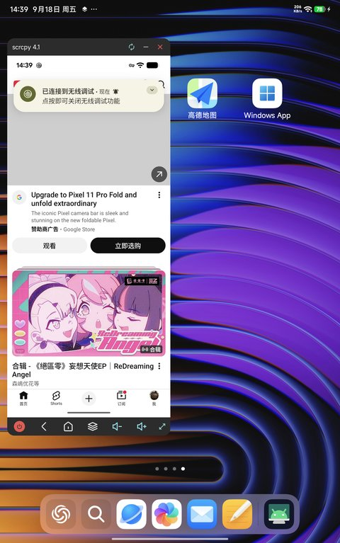

# scrcpy-android (v4.1)

<p align="center">
  
  
  
</p>

<p align="center">
  <b>Android 之间免 PC、免 Root 的高性能、超低延迟屏幕镜像与音频传输客户端，深度同步官方 Genymobile Scrcpy v4.1 协议。</b><br/>
  <b>High-performance, low-latency Android-to-Android screen mirroring and audio forwarding client powered by official Genymobile Scrcpy v4.1.</b>
</p>

<p align="center">
  <a href="#-简体中文"><b>简体中文</b></a> &nbsp;|&nbsp; <a href="#-english"><b>English</b></a>
</p>

<p align="center">
  <a href="https://github.com/xlzhen-940218/scrcpy-android/releases"></a>
  
  
  
  
  
</p>

---

## 🇨🇳 简体中文

### 🌟 概述

**scrcpy-android** 是一款能够在两台 Android 设备之间（手机、平板、Android TV / 电视盒子）直接进行屏幕镜像、反向控制以及实时音频传输的开源客户端。无需电脑中转，两台设备均**无需 Root**。

本项目基于官方 [Genymobile/scrcpy v4.1](https://github.com/Genymobile/scrcpy) 协议与服务端内核升级，支持硬件加速解码（H.264 / H.265 / AV1）、超低延迟音频转发（OPUS / AAC / PCM）、USB OTG 极速有线直连、Android 11+ 原生无线配对、双向横竖屏自适应同步，以及现代化的 Material Design 3 风格界面。

---

### 📥 下载安装

无需自行配置环境编译，直接前往本项目 GitHub Releases 页面下载预编译好的 APK 安装包即可：

👉 [**点击前往 GitHub Releases 下载最新 APK 安装包**](https://github.com/xlzhen-940218/scrcpy-android/releases)

> [!TIP]
> 建议下载标有 **`Latest`** 标签的最新发布版中的 `app-release.apk` 或 `app-debug.apk`。

---

### ✨ 核心特性

#### 🚀 连接与调试
- **USB 数据线直连（OTG 模式）**：通过 Type-C 数据线或 OTG 转接头将两台手机连接，直接走 USB Bulk 传输。彻底告别 Wi-Fi 干扰，带宽充足、帧率饱满、延迟极低。
- **Android 11+ 原生无线调试**：内置 TLS 证书与配对流程。输入受控设备的 6 位配对码和端口，一次配对即可长效连接。
- **传统 Wi-Fi ADB 支持**：全面兼容 `adb tcpip 5555` 经典连接方式。
- **连接历史记录**：自动保存最近 5 条成功连接记录，点击 IP 输入框即可从下拉菜单一键回填，无需重复手动输入。
- **设备断开自动感知**：投屏过程中拔出数据线或 Wi-Fi 网络异常时，自动弹窗提示并安全退出至首页，防止界面冻结或崩溃。

#### 📺 高性能音视频与同步
- **硬解 60 FPS 超清画质**：基于 Android 原生 `MediaCodec` 硬件解码器，支持 **H.264 (AVC)**、**H.265 (HEVC)** 与 **AV1** 编码格式。
- **原始分辨率点对点渲染**：支持"原始分辨率（不限制）"，根据受控端分辨率动态适配画面黑边（Letterboxing / Pillarboxing），杜绝拉伸变形。
- **实时音频转发**：将被控设备的游戏声、音乐与系统音频近乎零延迟同步输出到本端扬声器或耳机，支持 **OPUS**、**AAC** 与 **RAW PCM** 解码。
- **双向旋转同步**：控制端手机横竖屏翻转时，受控端会自动同步旋转；同时悬浮窗口和底部导航栏均配备旋转按钮，随时随心切换。

#### 🎮 控制与交互
- **多点触控与手势操作**：完整支持滑动、双指缩放、长按等操作，满足日常办公与移动游戏需求。
- **全屏投屏快捷导航栏**：全屏模式底部内置 6 个 SVG 快捷按键 — **电源键**、**返回**、**主屏幕**、**多任务**、**音量减**、**音量加** — 无需触碰受控设备即可完成常用操作，并配备旋转切换按钮。
- **悬浮窗快捷按键**：悬浮窗模式同样内置 **电源键**、**音量减**、**音量加** 快捷按键，随用随点。
- **物理音量键独立**：全屏或悬浮窗模式下，控制端的物理音量键**仅调节本机音量**，受控设备音量通过屏幕上的专用按钮操控，两端互不干扰。
- **Android TV & 遥控手柄支持**：支持方向键（上/下/左/右）、确认键、媒体键（播放/暂停/上一首/下一首）透传，适配 Android TV / 电视盒子使用场景。
- **双向剪贴板同步**：支持跨设备文本无缝复制粘贴。

#### 🌙 深色模式 & 界面体验
- **一键夜间模式**：应用右上角切换按钮即可在浅色 / 深色主题间切换，护眼且省电，偏好自动记忆。
- **Material Design 3 全新 UI**：全局采用 Material You 动态配色、圆角卡片、流畅动效，视觉体验现代而精致。
- **平板 / 手机双端适配**：响应式双栏布局，在大屏平板上信息密度更高，操作效率更强。

#### 🔋 省电与悬浮窗模式
- **熄屏镜像**：投屏期间受控设备可关闭物理屏幕，大幅减少发热并延长被控手机电池寿命。
- **保持唤醒**：防止被控设备在操作过程中息屏锁屏。
- **画中画悬浮窗**：支持多任务悬浮窗播放。悬浮窗自带右下角**等比例自由缩放手柄（⤡）**、拖拽移动、旋转按钮及最小化隐藏。
- **完整多语言（i18n）**：应用界面与日志全面支持中文与英文无缝切换。

---

### 📖 使用指南

#### 方法一：USB 数据线连接（推荐，延迟最低）
1. 在**受控手机**上开启【开发者选项】→ 开启【USB 调试】。
2. 使用 Type-C 双头线或 OTG 转接头连接两台 Android 设备。
3. 打开 **scrcpy-android**，顶部切换至 **【USB 数据线连接】** 标签页。
4. 点击 **【检测并连接 USB 设备】**，在弹出的系统权限弹窗中勾选"始终允许"并确认。
5. 握手成功后，点击 **【全屏投屏】** 或 **【悬浮窗投屏】**。
6. 使用完毕直接拔下数据线即可，程序会自动退出投屏并返回主页。

#### 方法二：Wi-Fi 无线调试配对（Android 11+）
1. 确保两台设备处于同一个局域网（Wi-Fi 或手机热点）。
2. 在**受控手机**上进入【设置】→【开发者选项】→【无线调试】。
3. 点击【使用配对码配对设备】，屏幕将显示 6 位配对码以及 IP 和临时配对端口。
4. 在 **scrcpy-android** 首页点击 **【无线配对 (Android 11+)】**，输入显示的 IP、端口和 6 位配对码，点击【开始配对】。
5. 配对成功后，将受控手机无线调试主界面显示的**连接端口**输入到首页 IP 输入框中（例如 `192.168.1.108:39123`）。
6. 点击 **【全屏投屏】** 即可。

> [!TIP]
> 曾连接过的设备 IP 会出现在历史记录模块，点击 IP 输入框时也可从下拉菜单中直接选择。

#### 方法三：传统 Wi-Fi ADB（Android 5 – 10）
1. 将受控手机通过电脑运行一次：
   ```bash
   adb tcpip 5555
   ```
2. 在 **scrcpy-android** 输入受控设备局域网 IP（例如 `192.168.1.108:5555`）。
3. 点击 **【全屏投屏】** 开始使用。

---

### 🛠️ 编译与开发

#### 环境要求
- **Android Studio** Hedgehog / Iguana / Jellyfish 或更新版本
- **JDK 17** 或 **JDK 21**
- **Android SDK** (API Level 34+)

#### 命令行编译构建
```bash
# 克隆仓库
git clone https://github.com/xlzhen-940218/scrcpy-android.git
cd scrcpy-android

# 编译生成 scrcpy-server 与 Debug 安装包
./gradlew assembleDebug
```

编译生成的 APK 路径：
```
app/build/outputs/apk/debug/app-debug.apk
```

---

### 🙏 鸣谢与开源致谢

本项目离不开以下优秀的开源项目、库及社区贡献者的启发与支持：

- **[Genymobile/scrcpy](https://github.com/Genymobile/scrcpy)**：由 Romain Vimont 及 Genymobile 团队打造的官方屏幕镜像核心，本项目底层协议与服务端均基于官方 v4.1 构建。
- **[huage2580/scrcpy-android](https://github.com/huage2580/scrcpy-android)**：Android 端投屏客户端的早期探索者与上游基础项目。
- **[com.tananaev:adblib](https://github.com/tananaev/adblib)**：轻量级 Java ADB 协议通信库，用于经典 ADB Socket 建立与数据流转发。
- **[com.github.MuntashirAkon:libadb-android](https://github.com/MuntashirAkon/libadb-android)**：现代 Android ADB 客户端实现，支持 Android 11+ TLS 无线配对与免 Root 调试。
- **[Google Conscrypt](https://github.com/google/conscrypt)** & **[Bouncy Castle](https://www.bouncycastle.org/)**：为 Android 11+ TLS 密钥协商与安全连接提供底层加密保障。
- **[Google Material Components](https://github.com/material-components/material-components-android)**：提供现代化 Material Design 3 风格组件与交互支持。

---

## 🇬🇧 English

### 🌟 Overview

**scrcpy-android** is an open-source Android application that enables high-performance screen mirroring, low-latency audio forwarding, and remote touch control between two Android devices (smartphones, tablets, and Android TV / Google TV boxes). It operates directly device-to-device over **USB OTG** or **Wi-Fi**, requiring **no PC** and **no root access** on either device.

Built on top of the official [Genymobile/scrcpy v4.1](https://github.com/Genymobile/scrcpy) protocol and server backend, it provides hardware-accelerated video decoding (H.264 / H.265 / AV1), real-time audio playback (OPUS / AAC / PCM), USB OTG bulk transfer, Android 11+ wireless TLS pairing, dynamic orientation synchronization, and a modern Material Design 3 interface.

---

### 📥 Download & Installation

Prebuilt APK packages are ready to install directly from the GitHub Releases page of this repository without compiling from source:

👉 [**Download Latest APK from GitHub Releases**](https://github.com/xlzhen-940218/scrcpy-android/releases)

> [!TIP]
> Download `app-release.apk` or `app-debug.apk` under the release tagged with **`Latest`** for the newest features and improvements.

---

### ✨ Key Features

#### 🚀 Connectivity
- **USB OTG Direct Connect**: Connect two Android devices directly using a USB-C to USB-C cable or an OTG adapter. Leverages USB bulk transfer for maximum throughput, zero Wi-Fi interference, and minimal latency.
- **Android 11+ Wireless Debugging**: Built-in TLS keypair generation and pairing workflow. Enter the target device's 6-digit pairing code and port once to pair and establish wireless connections.
- **Legacy Wi-Fi ADB**: Full backward compatibility with `adb tcpip 5555` connections.
- **Connection History**: Automatically saves up to 5 recently connected addresses. Tap the IP input field to select from a dropdown — no retyping needed.
- **Disconnect Auto-Return**: Automatically senses USB cable unplugs or network dropouts, alerts the user via Toast, and gracefully returns to the home dashboard.

#### 📺 Display & High-Fidelity Audio
- **Hardware-Accelerated 60 FPS**: Native `MediaCodec` pipeline with **H.264 (AVC)**, **H.265 (HEVC)**, and **AV1** decoding support.
- **Native Resolution**: Render at the remote device's unscaled resolution with dynamic letterboxing and pillarboxing, eliminating stretched screens.
- **Real-Time Audio Forwarding**: Streams audio from the controlled device directly to your speakers or headphones using **OPUS**, **AAC**, or **RAW PCM**.
- **Bi-Directional Rotation Sync**: Senses screen rotation on the controlling device and instructs the remote server to adapt orientation instantly, plus a dedicated manual rotation button.

#### 🎮 Controls & Interaction
- **Low-Latency Multi-Touch**: Full multi-touch support for gaming, pinch-to-zoom, and smooth scrolling gestures.
- **Fullscreen Navigation Bar**: 6 dedicated SVG icon buttons at the bottom — **Power**, **Back**, **Home**, **Recents**, **Volume Down**, **Volume Up** — plus a rotation toggle. Control the remote device without physically touching it.
- **Floating Window Quick Buttons**: The floating overlay features **Power**, **Volume Down**, and **Volume Up** shortcuts for instant one-tap remote control.
- **Independent Volume Keys**: Physical volume buttons on the controlling device **only adjust local volume** — remote volume is controlled exclusively via the on-screen buttons, keeping both sides independent.
- **Android TV & Gamepad Support**: D-pad (`UP/DOWN/LEFT/RIGHT`), `ENTER`, and media keys (`PLAY_PAUSE`, `NEXT`, `PREVIOUS`) are forwarded to the remote device, ideal for TV box control.
- **Bidirectional Clipboard**: Seamless text copy & paste between devices.

#### 🌙 Dark Mode & UI
- **One-Tap Dark Mode**: Toggle between light and dark themes from the top-right icon. Preference is persisted across sessions.
- **Material Design 3**: Dynamic Material You color system, rounded card layouts, and fluid micro-animations throughout.
- **Tablet / Phone Adaptive Layout**: Responsive two-column layout on large screens for higher information density and better ergonomics.

#### 🔋 Power Saving & Floating Window
- **Turn Screen Off**: Mirror and interact while the remote physical screen remains turned off to conserve battery and avoid overheating.
- **Stay Awake**: Keep the controlled device awake during active sessions.
- **Floating Window Mode (PiP)**: Keep the remote screen in a movable, resizable overlay. Includes a bottom-right **drag-to-resize handle (⤡)** with locked aspect ratios, rotation toggle, and minimize bar.
- **Complete Internationalization (i18n)**: Fully localized for Simplified Chinese (简体中文) and English.

---

### 📖 Usage Instructions

#### Method 1: USB OTG Connection (Recommended for Lowest Latency)
1. On the **controlled phone**, enable **Developer Options** → **USB Debugging**.
2. Connect both devices with a USB-C cable or OTG adapter.
3. Open **scrcpy-android**, switch to the **USB Connection** tab.
4. Tap **Scan & Connect USB Device** and grant USB permission when prompted.
5. Tap **Full-Screen Mirror** or **Floating Window**.
6. When done, simply unplug the cable — the app handles cleanup and navigates back to the main screen.

#### Method 2: Wi-Fi Wireless Debugging (Android 11+)
1. Connect both devices to the same Wi-Fi network (or personal hotspot).
2. On the **controlled phone**, navigate to **Settings** → **Developer Options** → **Wireless Debugging**.
3. Tap **Pair device with pairing code**.
4. In **scrcpy-android**, tap **Wireless Pairing (Android 11+)**, input the displayed IP address, pairing port, and 6-digit code, then tap **Pair**.
5. After pairing succeeds, enter the **Wireless Debugging connection port** into the IP field (e.g., `192.168.1.108:39123`).
6. Tap **Full-Screen Mirror**.

> [!TIP]
> Previously connected devices appear in the History section. You can also tap the IP field and select an address from the dropdown.

#### Method 3: Legacy Wi-Fi ADB (Android 5 – 10)
1. Connect the controlled device once to a computer and execute:
   ```bash
   adb tcpip 5555
   ```
2. Enter the target phone's IP address (e.g., `192.168.1.108:5555`) in **scrcpy-android**.
3. Tap **Full-Screen Mirror**.

---

### 🛠️ Build & Development

#### Prerequisites
- **Android Studio** Hedgehog / Iguana / Jellyfish or newer
- **JDK 17** or **JDK 21**
- **Android SDK** (API level 34+)

#### Command-Line Build
```bash
git clone https://github.com/xlzhen-940218/scrcpy-android.git
cd scrcpy-android
./gradlew assembleDebug
```

Output APK will be located at:
```
app/build/outputs/apk/debug/app-debug.apk
```

---

### 🙏 Acknowledgements & Credits

This project is made possible thanks to the following outstanding open-source projects, libraries, and authors:

- **[Genymobile/scrcpy](https://github.com/Genymobile/scrcpy)**: The official high-performance screen mirroring solution created by Romain Vimont and Genymobile team. The core protocol and server backend of this project are powered by official scrcpy v4.1.
- **[huage2580/scrcpy-android](https://github.com/huage2580/scrcpy-android)**: Upstream project and early pioneer of scrcpy client on Android.
- **[com.tananaev:adblib](https://github.com/tananaev/adblib)**: Lightweight Java ADB protocol library for classic TCP/IP ADB connection and socket streams.
- **[com.github.MuntashirAkon:libadb-android](https://github.com/MuntashirAkon/libadb-android)**: Modern Android ADB library powering native Android 11+ TLS wireless debugging and pairing.
- **[Google Conscrypt](https://github.com/google/conscrypt)** & **[Bouncy Castle](https://www.bouncycastle.org/)**: Cryptographic security providers for modern TLS key exchange and encryption.
- **[Google Material Components](https://github.com/material-components/material-components-android)**: Modern UI widgets and Material Design 3 styling.

---

## 🏗️ Architecture & Modules

```
scrcpy-android/
├── app/                              # Android client application
│   ├── src/main/java/org/las2mile/scrcpy/
│   │   ├── MainActivity.java         # Material 3 dashboard, connection history & dark mode
│   │   ├── ScreenMirrorActivity.java # Full-screen rendering, nav bar buttons & orientation sync
│   │   ├── DisplayWindow.java        # Resizable floating window & touch event translation
│   │   ├── FloatService.java         # Foreground overlay service with SVG button controls
│   │   ├── Scrcpy.java               # Protocol stream demuxer & client coordinator
│   │   ├── SendCommands.java         # ADB protocol engine & server deployment
│   │   ├── adb/                      # TLS keypair negotiation & wireless pairing
│   │   ├── decoder/VideoDecoder.java # Hardware-accelerated MediaCodec video decoding
│   │   ├── audio/AudioPlayer.java    # AudioTrack playback (RAW PCM / OPUS / AAC)
│   │   └── usb/                      # USB Host ADB bridge & bulk packet forwarder
│   └── src/main/res/                 # Layouts, SVG drawables, and bilingual strings (zh / en)
│
└── server/                           # Scrcpy v4.1 Java server
    └── src/main/java/com/genymobile/scrcpy/
        ├── Server.java               # Scrcpy server entry point
        ├── Device.java               # Display capture, touch injection, orientation lock
        ├── video/                    # Screen encoder & virtual display pipeline
        └── audio/                    # Audio capture & encoding pipeline
```

---

## 📄 License

- **Client application (`app`)**: Licensed under the [GNU General Public License v3.0 (GPLv3)](LICENSE).
- **Server component (`server`)**: Licensed under the [Apache License 2.0](https://www.apache.org/licenses/LICENSE-2.0).
- Based on the desktop project [Genymobile/scrcpy](https://github.com/Genymobile/scrcpy).
